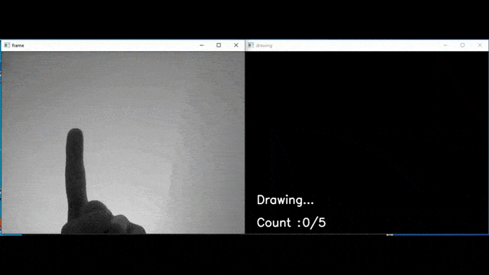

# Finger Tracking

Hello and welcome to this personal project. The goal is to track the finger in order to draw digits, and use deep learning to recognize the digit drawn. 

<p align="center">
  
</p>


## Description

To be able to track the finger, we use the template matching method : this method consists in finding a template image in an input image. We use the bult-in function from OpenCV `cv2.matchTemplate` to do so. This method works well when the background is uniform and either black or white (because the background color in the template image is black), but it fails to track the finger when the background is more diverse.

Then, we need to recognize what is the digit. We build CNN with Pytorch to be able to train a classifier.

## Technologies used

[NumPy](https://numpy.org/): version 1.18.5<br/>
[pandas](https://pandas.pydata.org/): version 1.0.5<br/>
[PyTorch](https://pytorch.org/): version 1.7.0  <br/>
[OpenCV](https://opencv.org/): version 4.5.1


## Description of the Github repo

### [classifier_fonts](classifier_fonts/)

In this folder, we create a classifier trained with digits written using opencv.

### [classifier_handwritten](classifier_handwritten/)

In this folder, we create a classifer trained with handwritten digits

### [cnn_img.py](cnn_img.py)

This file contains the classifier class, we will import it in the `track_finger_template.py` file

### [finger_template2.jpg](finger_template2.jpg)

Image used as a template to locate the finger

### [track_finger_template.py](track_finger_template.py)

Main script. It has 2 arguments :
- `classifier` : classifier to use, either 'font' or 'handwritten'
- `background_color` : the color of the background, 'black' or 'white'


## Example of use

If you want to use the classifier trained with handwritten images, and you have a white background, run :

```
python track_finger_template.py --classifier handwritten --background_color white
```

# Sources
- cv2 tutorials on python : https://opencv-python-tutroals.readthedocs.io/en/latest/py_tutorials/py_tutorials.html
- cv2 list of fonts : https://www.codesofinterest.com/2017/07/more-fonts-on-opencv.html
- Image classification : https://towardsdatascience.com/how-to-train-an-image-classifier-in-pytorch-and-use-it-to-perform-basic-inference-on-single-images-99465a1e9bf5
